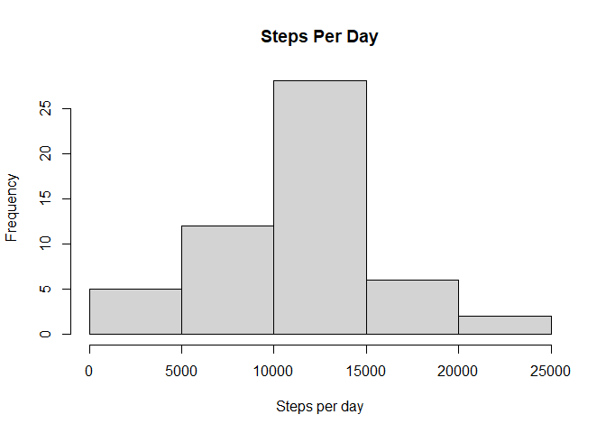
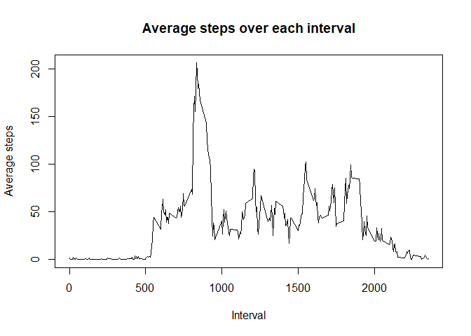
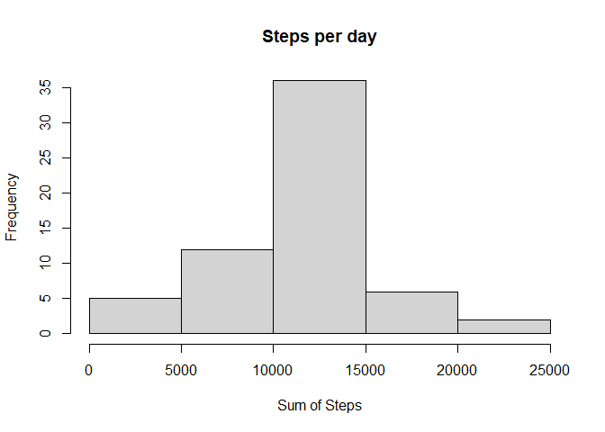
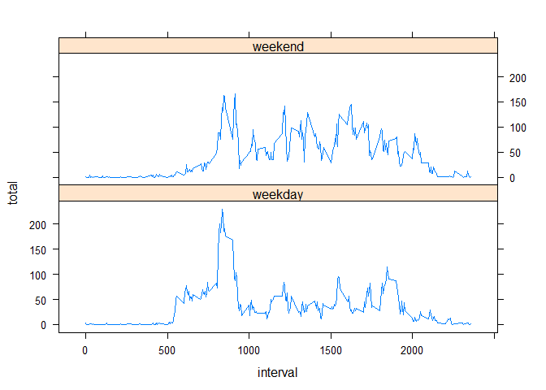

## Loading and preprocessing the data
```
Show any code that is needed to

1). Load the data (i.e. read.csv())
2). Process/transform the data (if necessary) into a format suitable for your analysis
```
Install packages:  

```r
library(dplyr)
library(lattice)
library(tidyr)
```
  
Get, download, and unzip file from url:

```r
#creates file
filename <- "steps.zip"

#if filename above does not exist, then downloads the file to filename
if (!file.exists(filename)){
        url <- "https://d396qusza40orc.cloudfront.net/repdata%2Fdata%2Factivity.zip"
        download.file(url, filename, method = "curl")
}

#if steps dataset does not exist, unzip the files in filename to this directory
if (!file.exists("steps")){
        unzip(filename)
}
```

Read in data and remove NA values: 

```r
# reads in data
step_file <- read.csv("activity.csv", header=TRUE, sep=",", colClasses = c('numeric', 'character', 'numeric'))

# removes NA values
step_data <- step_file[ with(step_file, { !(is.na(step_file)) } ), ]
```

## What is mean total number of steps taken per day?
```
For this part of the assignment, you can ignore the missing values in the dataset.

1). Calculate the total number of steps taken per day
2). Make a histogram of the total number of steps taken each day
3). Calculate and report the mean and median of the total number of steps taken per day


```

Calculate the total number of steps taken per day by grouping by date and summing over steps

```r
day_steps <- step_data %>% group_by(date) %>% summarise(total = sum(steps))
```

Create a histogram of the the total number of steps taken per day

```r
hist(day_steps$total, xlab = "Steps per day", main="Steps Per Day")
```

<!-- -->

### Mean and median of the total number of steps taken per day:

```r
signif(mean(day_steps$total, na.rm = TRUE), digits=5)
```

```
## [1] 10766
```

```r
median(day_steps$total, na.rm = TRUE)
```

```
## [1] 10765
```

## What is the average daily activity pattern?
```
1). Make a time series plot (i.e. type = "l") of the 5-minute interval (x-axis) and the average number of steps taken, averaged across all days (y-axis)
2). Which 5-minute interval, on average across all the days in the dataset, contains the maximum number of steps?
```
Make a time series plot of the number of steps per interval averaged over each day

```r
avg_steps <- group_by(step_data, interval)
avg_steps <- summarise(avg_steps, steps_avg=mean(steps))
avg_steps_plot <- with(avg_steps, plot(steps_avg ~ interval, type ="l", ylab="Average steps", xlab="Interval", main="Average steps over each interval"))
```

<!-- -->

Group data by interval and average over steps to find interval with maximum average steps

```r
max_steps <- which.max(avg_steps$steps_avg)
avg_steps[max_steps,]
```

```
## # A tibble: 1 x 2
##   interval steps_avg
##      <dbl>     <dbl>
## 1      835      206.
```


## Imputing missing values
```
Note that there are a number of days/intervals where there are missing values (coded as NA). The presence of missing days may introduce bias into some calculations or summaries of the data.

1). Calculate and report the total number of missing values in the dataset (i.e. the total number of rows with NAs)
2). Devise a strategy for filling in all of the missing values in the dataset. The strategy does not need to be sophisticated. For example, you could use the mean/median for that day, or the mean for that 5-minute interval, etc.
3). Create a new dataset that is equal to the original dataset but with the missing data filled in.
4). Make a histogram of the total number of steps taken each day and. Calculate and report the mean and median total number of steps taken per day. Do these values differ from the estimates from the first part of the assignment? What is the impact of imputing missing data on the estimates of the total daily number of steps?
```
Find the number of NAs in the steps column

```r
sum(is.na(step_file$steps))
```

```
## [1] 2304
```

Imputing NA values in the steps column, creating the dataset imputed_data.  
Impute method: Average for the interval the NA is in

```r
interval_group <- step_file %>% group_by(interval) %>% summarise(steps_mean=mean(steps, na.rm=TRUE))
imputed_data <- step_file
imputed_data$steps <- ifelse(is.na(step_file$steps), interval_group$steps_mean, step_file$steps)
```

Histogram of the total number of steps taken each day:

```r
imp_date <- imputed_data %>% group_by(date) %>% summarise(Steps_total=sum(steps))
hist(imp_date$Steps_total, xlab = "Sum of Steps", main = "Steps per day")
```

<!-- -->

Mean and median of the total number of steps taken each day

```r
summary(imp_date)
```

```
##      date            Steps_total   
##  Length:61          Min.   :   41  
##  Class :character   1st Qu.: 9819  
##  Mode  :character   Median :10766  
##                     Mean   :10766  
##                     3rd Qu.:12811  
##                     Max.   :21194
```


## Are there differences in activity patterns between weekdays and weekends?
```
For this part the weekdays() function may be of some help here. Use the dataset with the filled-in missing values for this part.

1). Create a new factor variable in the dataset with two levels – “weekday” and “weekend” indicating whether a given date is a weekday or weekend day.
2). Make a panel plot containing a time series plot (i.e. type = "l") of the 5-minute interval (x-axis) and the average number of steps taken, averaged across all weekday days or weekend days (y-axis). See the README file in the GitHub repository to see an example of what this plot should look like using simulated data.
```
Using the imputed data, creating a new factor variable 'daytype' with two levels - "weekday" and "weekend" indicating whether a given date is a weekday or weekend day.

```r
imputed_data$date <- as.POSIXct(imputed_data$date)
week_sort <- imputed_data
week_sort$date <- weekdays(week_sort$date)
week_sort$daytype <- factor(ifelse(week_sort$date=="Saturday"|week_sort$date=="Sunday", "weekend", "weekday"))
```

Grouping data by 'interval' and then by 'daytype' and taking the mean over 'steps'. Then creating a panel plot of the 5-minute interval (x-axis) and the average number of steps taken, averaged across all weekday days or weekend days (y-axis).

```r
day_type_sum <- week_sort %>% group_by(interval, daytype) %>% summarise(total=mean(steps))
xyplot(total~interval|daytype, data = day_type_sum, type = "l", layout=c(1,2))
```

<!-- -->

